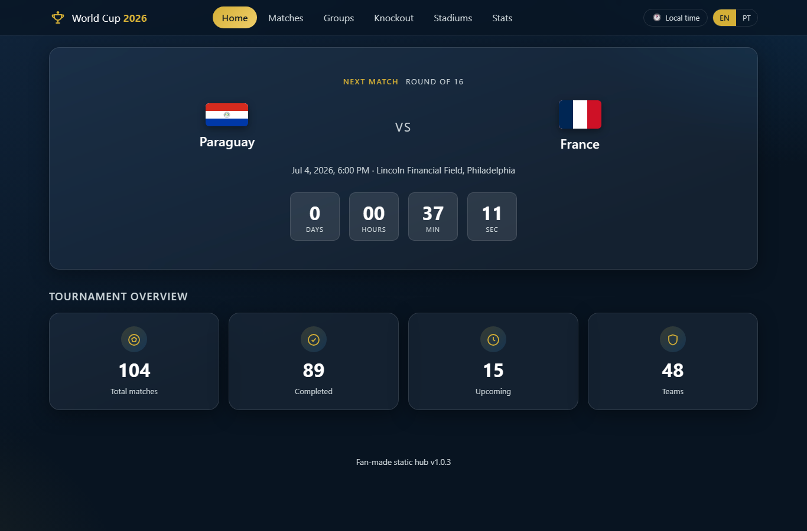
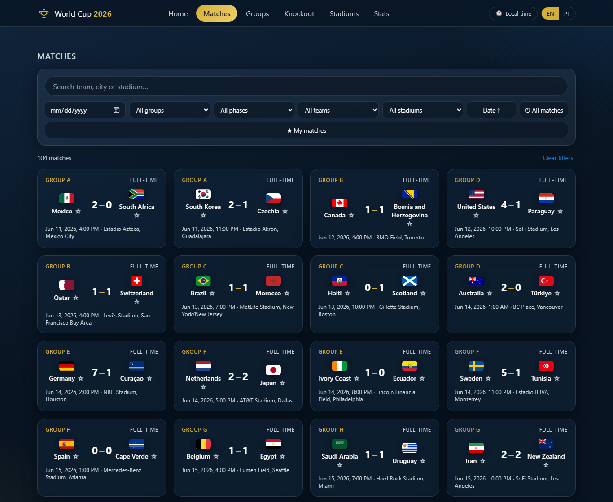
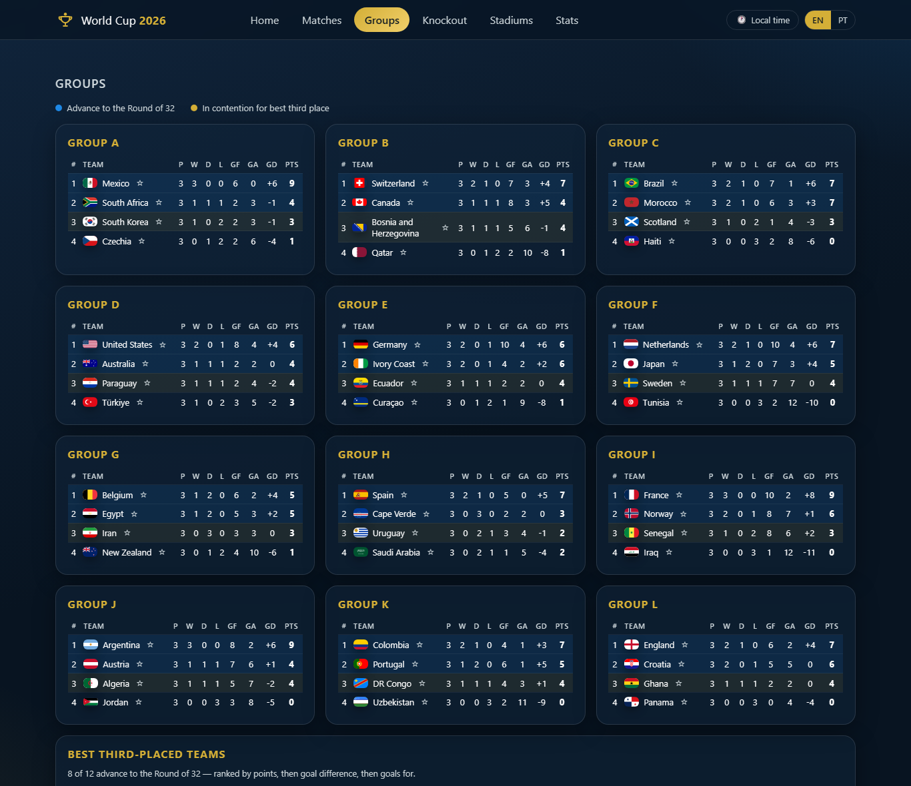
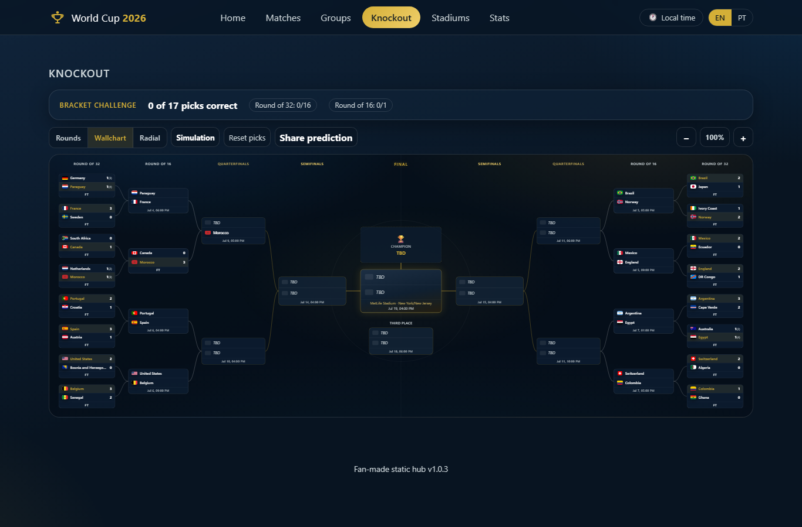
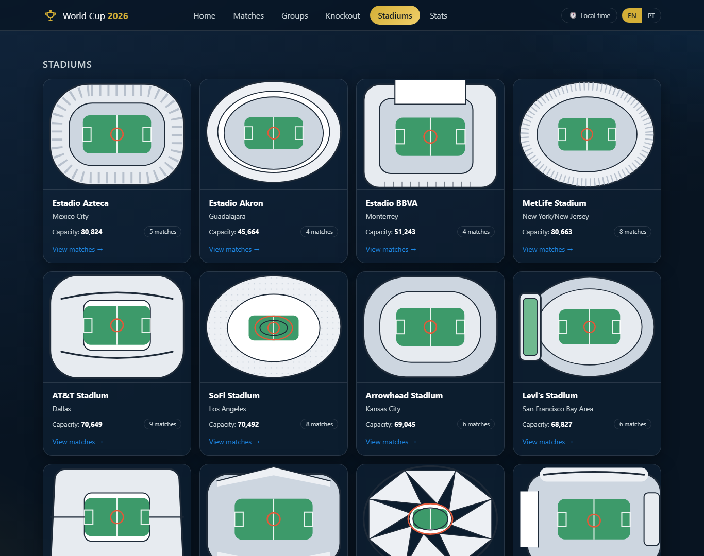
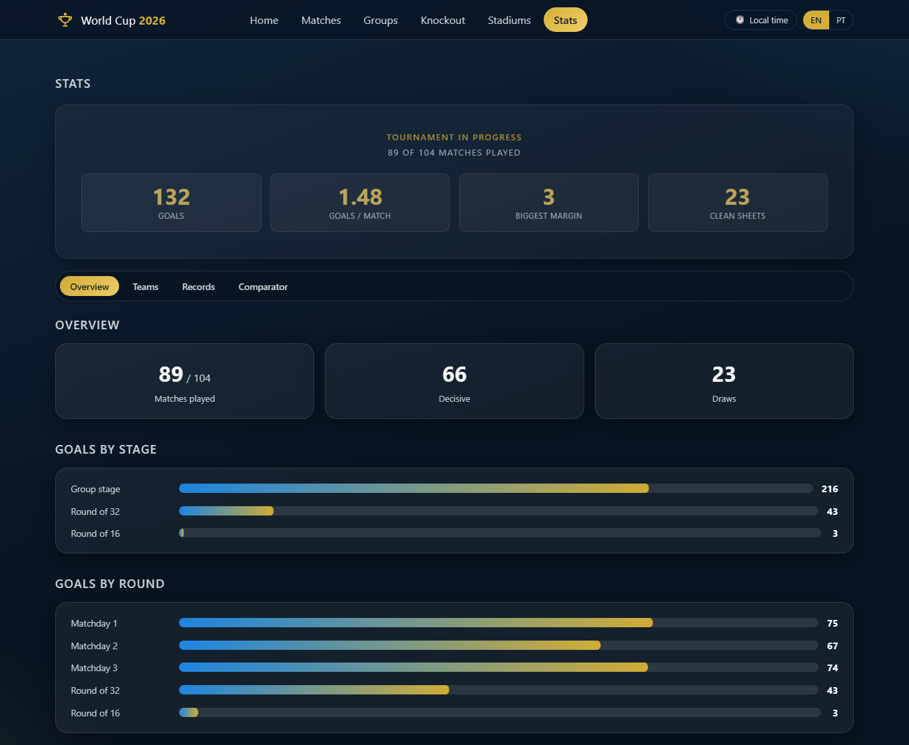

# 🏆 World Cup 2026 Hub

### Follow the entire FIFA World Cup 2026 in one beautiful place — the schedule, live group standings, an interactive knockout bracket you can predict, the stadiums, and full tournament stats.

---

## What is this?

**World Cup 2026 Hub** is a fan-made website for the FIFA World Cup 2026 — the first tournament
hosted across **Mexico, the USA and Canada**, with **48 teams** and **104 matches**.

It pulls the whole tournament onto a single, fast page: when the next match kicks off, how every
group is shaping up, who advances, where the games are played, and how *you'd* fill out the knockout
bracket. Results roll in as the tournament goes, and you can flip the entire interface between
**English and Português** at any time.

Nothing to install (although you can — see [Under the hood](#-under-the-hood-for-the-curious)), no
sign-up, no ads. Just open it.

> 🔗 **Try it now → [lucaskalil.com/worldcup2026](https://lucaskalil.com/worldcup2026)**

---

## 🎬 Explore the pages

### 🏠 Home
*The next match with a live countdown, plus the tournament at a glance.*

### 📅 Matches
*All 104 games in one place — search by team, city or stadium, filter by date, group, phase, team or venue, and flag your favourites with “My matches”.*

### 📊 Groups
*Live standings for all 12 groups, worked out automatically from the results — points, goal difference, goals scored — with clear markers for who qualifies (and who’s chasing a best-third-place spot).*

### 🏆 Knockout bracket
*The centrepiece. A gorgeous interactive bracket that fills itself in as teams advance. Hover a team to trace its whole path to the final, zoom and pan around, switch between three layouts — **and predict it yourself**: pick winners, watch the rounds re-draw, then see how your picks score against the real results. You can even share your bracket as a link.*

### 🏟️ Stadiums
*All 16 host venues across the three countries, each with its capacity and a jump straight to the matches played there.*

### 📈 Stats
*A tournament stats screen: goals by stage and by round, records, a full 1–48 ranking and a head-to-head team comparator. Once the final is played, a champion “verdict” takes over the top of the page.*

---

## ✨ Under the hood (for the curious)

You don't need to be a developer to appreciate a few things that make this special:

- **⚡ Loads in a blink.** The whole site is about **74 KB** of JavaScript — smaller than a single
  phone photo — with **no frameworks and no libraries**. It's just clean, hand-written code.
- **🔮 Predict the bracket.** Choose winners and the bracket redraws all the way to the final; your
  picks are saved in your browser and can be handed to a friend as a link to compare.
- **🔄 Always current.** New scores appear on their own — no need to refresh the page.
- **📱 Works everywhere.** Phone, tablet or desktop, the layout adapts to fit.
- **⬇️ Installable.** Add it to your home screen and it opens like a real app (it's a PWA).
- **🌍 Two languages.** Every label is available in English and Portuguese, switchable on the fly.
- **♿ Built to be usable by everyone.** Full keyboard navigation, screen-reader labels, and it
  respects the system “reduce motion” setting.

Curious how it's put together, or want to run it yourself? See **[DEVELOPMENT.md](DEVELOPMENT.md)**.

---

Made by **[Lucas Kalil](https://lucaskalil.com)** · Vanilla HTML, CSS & JavaScript.

A fan-made project for the love of the game. Not affiliated with, endorsed by, or sponsored by
FIFA. All team and venue names belong to their respective owners.

